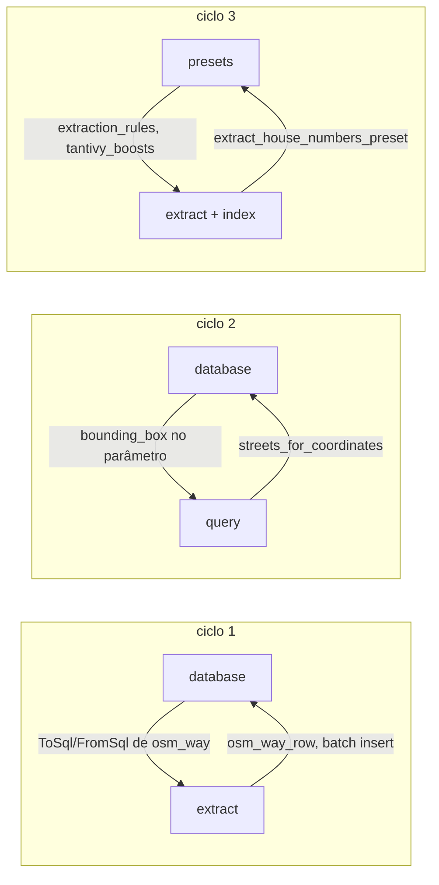
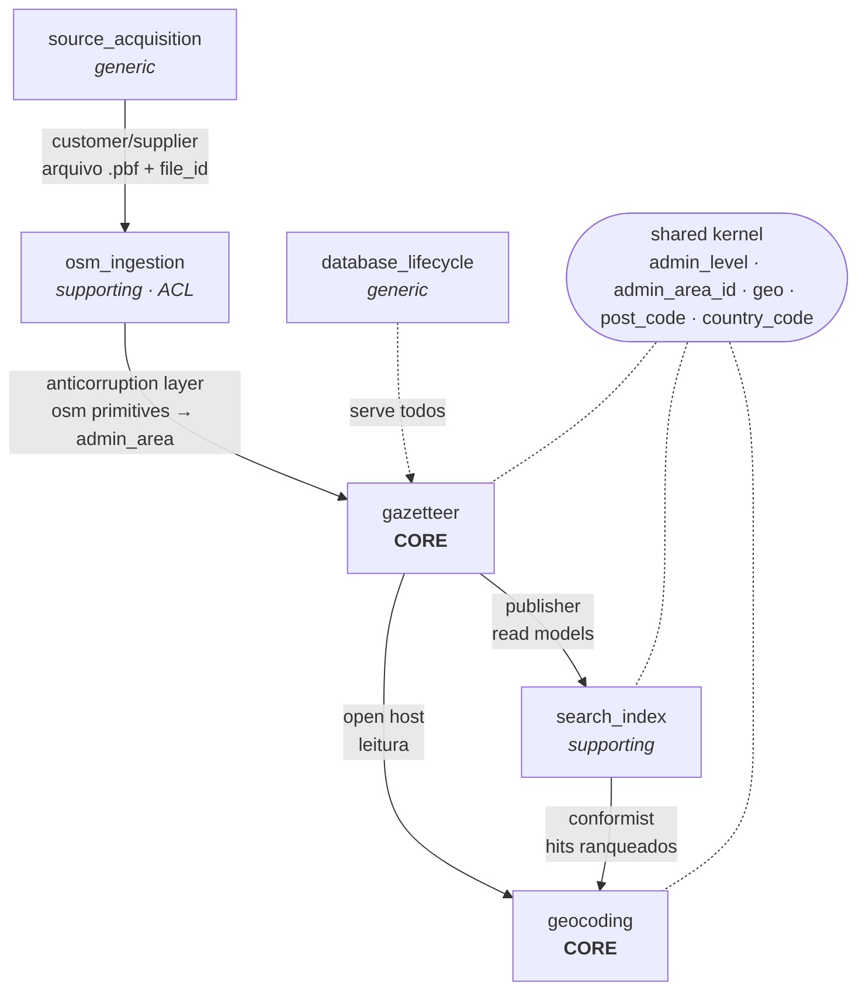

# spec: refatoração para ddd

> documento de arquitetura para a migração do geolite de um pipeline em camadas técnicas
> para uma organização por domínio (ddd).
> escrito em pt-br; identificadores, tipos e nomes de teste permanecem em inglês.

> **duas decisões posteriores substituem partes deste documento** (registradas em `decisions.md`):
>
> 1. **a organização é por fatia vertical, não por camadas.** cada conceito tem uma pasta em
>    `src/domain/` que carrega o próprio i/o, em vez de um domínio puro cercado por
>    `application`/`infrastructure`/`presentation`. o §7 descreve o alvo antigo.
> 2. **os domínios tomam o nome da tabela.** `admin_area` não existe: a entidade é `admin_level`,
>    e a escala (1..30) é um enum `level` dentro dela. não há shared kernel — o §5 e o §6.1
>    descrevem uma divisão que foi abandonada.
>
> o diagnóstico (§2), a linguagem ubíqua (§4) e os achados de acoplamento seguem válidos e são o
> que orienta a execução.

---

## 0. resumo executivo

o geolite hoje tem **10.699 linhas** não-teste e **10.727 linhas** de teste (423 testes), organizadas em
9 módulos de topo nomeados pelo *estágio técnico* do pipeline (`cli`, `database`, `osm_pbf_file`,
`extract`, `index`, `optimize`, `query`, `http`, `presets`).

o código não está bagunçado — o pipeline é coerente e os estágios já são separados de seus handlers de
cli. o problema é outro e é estrutural:

> **o modelo de domínio não existe como código.** ele está diluído entre fragmentos de sql,
> structs nomeadas pela query que as produziu, literais mágicos repetidos em três linguagens
> e regras de negócio implementadas duas vezes — uma em sql, outra em rust.

evidência medida, não impressão:

| sintoma | medição |
|---|---|
| ciclos de dependência entre módulos de topo | **3** |
| traits de porta (abstração de i/o) | **0** |
| arquivos fora de `database/` acoplados a `rusqlite::Connection` | **18** |
| funções não-teste retornando `Result<_, _>` | **7** |
| `expect(` / `unwrap()` / `panic!` / `process::exit` (não-teste) | **194 / 65 / 3 / 13** |
| `#[allow(clippy::too_many_arguments)]` | **9** |
| entidade `admin_area` projetada em structs distintas | **5** |
| implementações independentes de "friendly name" | **2** |
| implementações independentes da regra de "house number" | **2** (uma em sql, uma em rust) |

a proposta: **6 bounded contexts + shared kernel**, arquitetura hexagonal, migração em **8 fases**
mergeáveis independentemente, com comportamento observável inalterado e schema congelado.

---

## 1. objetivo e escopo

### 1.1 objetivos

1. **tornar o modelo explícito**: `admin_area`, `street`, `house_number`, `ancestry`, `place_label`,
   `geocode_match` viram tipos de primeira classe, testáveis sem i/o.
2. **inverter as dependências**: o domínio não conhece sqlite, tantivy, ureq, tiny_http, clap nem geozero.
3. **um conceito, uma implementação**: eliminar as duplicações de `house_number`, `place_label` e
   `admin_level`.
4. **erros como valores**: `Result` até a borda; `panic!`/`process::exit` só nos adapters.
5. **consumível como biblioteca**: introduzir `lib.rs` (hoje o crate é binário puro), habilitando
   testes de integração e uso do geolite como dependência.

### 1.2 não-objetivos (anti-metas explícitas)

estas linhas existem para impedir que a refatoração vire um exercício acadêmico:

1. **não** modelar o etl bruto de pbf como domínio rico. `osm_node`/`osm_way`/`osm_relation` são dados de
   passagem, com payload jsonb pré-codificado e escrita em lote de 10.000 linhas
   (`database/osm_ways.rs:33`). transformar cada nó em entidade destruiria o throughput de um build de
   45 gb. ali o padrão correto é **anticorruption layer + pipeline**, não agregados.
2. **não** introduzir orm, unit-of-work genérico, event sourcing, barramento de eventos ou container de
   di. rust já resolve injeção com generics e `&dyn` na fronteira.
3. **não** alterar o schema sqlite (`SCHEMA_VERSION` permanece `1`) nem o json de saída da api. qualquer
   mudança de schema vira task separada, depois da refatoração.
4. **não** abandonar `#![allow(nonstandard_style)]` e os tipos em snake_case — é o estilo da casa e
   trocá-lo agora poluiria todo diff da refatoração.
5. **não** perseguir pureza onde ela não paga. `optimize::sqlite_file` (`ANALYZE` + `VACUUM`) é
   infraestrutura chamada direto pelo adapter; não ganha porta.

### 1.3 critérios de aceite (mensuráveis)

| métrica | hoje | alvo |
|---|---:|---:|
| ciclos de dependência entre módulos de topo | 3 | **0** |
| arquivos fora de `infrastructure/` mencionando `rusqlite` | 18 | **0** |
| arquivos fora de `infrastructure/` mencionando `tantivy` | 4 | **0** |
| `#[allow(clippy::too_many_arguments)]` | 9 | **0** |
| `process::exit` fora de `presentation/` | 13 | **0** |
| casos de uso retornando `Result` | 0 | **100%** |
| testes de domínio que não abrem sqlite | ~0 | **≥ 60% dos testes** |
| `cargo clippy --all-targets -D warnings` | limpo | **limpo** |
| saída de `geolite query` sobre fixture golden | — | **byte-idêntica** |
| tempo de `build` sobre pbf de referência | baseline | **≤ baseline + 5%** |

---

## 2. estado atual

### 2.1 mapa de módulos

| módulo | arquivos (não-teste) | papel hoje | papel no alvo |
|---|---:|---|---|
| `cli` | 21 | parsing clap + handlers + progress bars + `exit` | presentation adapter |
| `database` | 10 | sql + rusqlite, um módulo por tabela | infrastructure (repositórios) |
| `extract` | 12 | pbf → linhas cruas → admin_levels/house_numbers | acl (ingestão) + core (gazetteer) |
| `index` | 5 | rtree, hierarquia, tantivy | core (hierarquia) + infra (índices) |
| `optimize` | 3 | vacuum, remoção de dados intermediários | infrastructure |
| `osm_pbf_file` | 3 | catálogo geofabrik + download paralelo | acquisition (core fino + infra) |
| `query` | 4 | resolução texto/coordenada → matches | core (geocoding) |
| `http` | 3 | tiny_http, openapi, status | presentation adapter |
| `presets` | 1 | configuração por país (3 contextos misturados) | policies por contexto |

### 2.2 matriz de dependências

contagem de referências `crate::<módulo>` em arquivos **não-teste** (linhas = importador, colunas = importado):

| de \ para | cli | database | extract | index | optimize | osm_pbf_file | query | http | presets |
|---|---:|---:|---:|---:|---:|---:|---:|---:|---:|
| **cli** | · | 60 | 8 | 9 | 5 | 4 | 4 | 2 | 8 |
| **database** | – | · | **6** | – | – | – | **2** | – | – |
| **extract** | – | 64 | · | – | – | – | – | – | **1** |
| **index** | – | 28 | – | · | – | – | – | – | **2** |
| **optimize** | – | 1 | – | – | · | – | – | – | – |
| **osm_pbf_file** | – | 1 | – | – | – | · | – | – | – |
| **query** | – | 22 | 4 | 2 | – | – | · | – | – |
| **http** | – | 1 | – | 4 | – | – | 14 | · | – |
| **presets** | – | – | **1** | **2** | – | – | – | – | · |

as células em negrito são as arestas que fecham ciclo.

### 2.3 os três ciclos



**ciclo 1 — `database` ↔ `extract`**

```
src/database/osm_nodes.rs:4      impl ToSql   for crate::extract::osm_data::osm_nodes::osm_node
src/database/osm_ways.rs:4       impl ToSql   for crate::extract::osm_data::osm_ways::osm_way
src/database/osm_relations.rs:4  impl ToSql   for crate::extract::osm_data::osm_relations::osm_relation
src/extract/osm_data/mod.rs:174  crate::database::osm_nodes::osm_node_row
```

a infraestrutura precisa do tipo que o pipeline define, e o pipeline precisa da linha que a
infraestrutura define. o modelo de dados mora nos dois lados.

**ciclo 2 — `database` ↔ `query`**

```
src/database/admin_levels.rs:279  bbox: crate::query::bounding_box
src/database/admin_levels.rs:319  pub fn ids_in_bounding_box(conn: &Connection, bbox: crate::query::bounding_box)
src/query/coordinates.rs:30       crate::database::admin_levels::streets_for_coordinates(...)
```

`bounding_box` é um value object de domínio (envelope geográfico) declarado na camada de aplicação e
consumido pela camada de persistência. a seta está invertida.

**ciclo 3 — `presets` ↔ `extract`/`index`**

```
src/presets.rs:12                  crate::extract::admin_levels::extraction_rules
src/presets.rs:26                  crate::index::admin_levels_hierarchy_tantivy::tantivy_boosts
src/extract/house_numbers.rs:165   preset: crate::presets::extract_house_numbers_preset
src/index/user_friendly_name.rs:13 preset: &crate::presets::index_user_friendly_name_preset
```

a configuração conhece o formato interno de dois estágios, e os dois estágios conhecem a configuração.

### 2.4 inventário de vazamentos

| # | vazamento | evidência | consequência |
|---|---|---|---|
| 1 | uma entidade, cinco projeções nomeadas pela query | `admin_levels`, `admin_level_geom_row`, `admin_area_row`, `admin_meta_row`, `street_query_row` em `database/admin_levels.rs` | não há um lugar onde "o que é uma área administrativa" esteja escrito |
| 2 | identidade escondida na persistência | `pack_admin_id` (`database/admin_levels.rs:91`) + `panic!` em `:642` quando faltam ambos os ids | invariante de identidade só é verificada em runtime, dentro de um batch insert |
| 3 | nível administrativo em três linguagens | `enum osm_admin_level` (`extract/admin_levels/mod.rs:9`), `const STREET_LEVEL: u8 = 12` (`database/admin_levels.rs:182`), literal `admin_level = 12` em `SQL_STREETS_FOR_COORDINATES` e `SQL_STREETS_WITH_GEOMETRY` | mudar a semântica de "rua" exige caçar sql, const e enum |
| 4 | estratégia de vínculo como u8 mágico | `STRATEGY_BY_PROXIMITY: u8 = 0` / `STRATEGY_BY_NAME: u8 = 1` (`extract/house_numbers.rs:16`), coluna `strategy INTEGER` | o readme documenta os nomes; o código não os tem |
| 5 | **regra de house number partida entre sql e rust** | normalização em `SQL_LOAD_ALL_CANDIDATES` (`database/house_numbers.rs:31`, `CASE/GLOB`); parsing em `is_house_number_token` (`query/house_number.rs:23`) | é exatamente a causa do bug aberto em `tasks.md` (nomenclatura colombiana `82-52`) |
| 6 | friendly name implementado duas vezes | índice: `with_postcode` + cadeia em `index/hierarchy.rs:367`; consulta: `default_friendly_name` + `render_friendly_name` em `query/mod.rs:226` | a versão do índice inclui post code; a da consulta não — divergem |
| 7 | value object construído no adapter | `parse_bounding_wkt` mora em `http/mod.rs:294` e é usado pelo cli (`cli/mod.rs:125`) e pelos testes de query | um adapter virou dependência de outro adapter |
| 8 | preset atravessa quatro camadas | `cli/mod.rs:282` → `http_server` → `http::serve` → `tantivy::load`, só para entregar `boosts` | acoplamento de configuração de ranking a toda a stack |
| 9 | paralelismo dentro do "domínio" | `index/hierarchy.rs:225` e `index/coordinates.rs:84` reabrem `Connection` em workers; `conn.path().filter(|p| !p.is_empty())` como gambiarra de `:memory:` | o algoritmo não roda sem sqlite; o caso de teste virou caso de produção |
| 10 | id de persistência no dto público | `query_match.admin_level_id: Option<i64>` com `#[serde(skip)]` (`query/mod.rs:62`) | dto de api carrega estado interno do pipeline de enriquecimento |
| 11 | análise textual dentro do adapter tantivy | `tokenize` e `build_entity_text` em `index/admin_levels_hierarchy_tantivy.rs`, importados por `query/address.rs:6` | regra de domínio (o que é um token, o que compõe o texto de um lugar) vive no adapter |
| 12 | política de extração como fragmento sql | `enum filters` com `as_sql()` em `database/osm_ways.rs:103`, referenciado por `presets.rs` via `extraction_rules` | a política de inclusão/exclusão de vias é expressa em sql |
| 13 | resolução de fonte no `main.rs` | `resolve_osm_pbf_path` (`main.rs:21`), mais heurísticas em `cli/build.rs:27` e `osm_pbf_file/ls.rs:88` | três lugares adivinham o que é um "source" |
| 14 | erro = encerrar processo | 13 `process::exit`, 194 `expect(`, `known_errors::exit` (`cli/mod.rs:157`) | testar caminhos de erro exige respawn do binário |
| 15 | sem `lib.rs` | `main.rs:2-10` declara todos os módulos | impossível escrever teste de integração ou consumir como biblioteca |

### 2.5 o que já está certo (preservar)

não jogar fora o que funciona:

- **handler de cli separado do runner de estágio**: `cli/extract/osm_admin_levels.rs` (apresentação) vs
  `extract/admin_levels/mod.rs` (lógica) já é um adapter fino. o alvo formaliza esse corte, não o inventa.
- **progresso por callback**: `impl Fn(progress_report)` já é uma porta de saída informal em todos os
  estágios. vira trait `progress_sink`, sem mudança de arquitetura.
- **split do sqlite** (`database.sqlite3` + `database.osm_data.sqlite3`) e o `PRAGMA user_version`:
  decisões registradas em `decisions.md`, mantidas intactas.
- **read models materializados**: `admin_levels_hierarchy`, `admin_levels_rtree` e o índice tantivy já são
  projeções cqrs de fato. a refatoração dá nome ao que já existe.
- **testes co-localizados** `.test.rs` via `#[path]`: mantidos, inclusive a regra de nomes em inglês.
- **`pack_admin_id`**: a ideia (id estável derivado da identidade osm, namespaces disjuntos de way e
  relation por um bit) é boa. só está no lugar errado.

---

## 3. princípios da refatoração

1. **regra da dependência**: `domain` ← `application` ← `infrastructure` / `presentation`.
   nenhum arquivo em `domain` importa `rusqlite`, `tantivy`, `ureq`, `tiny_http`, `clap`, `geozero`,
   `indicatif` ou `prost`.
2. **ddd tático só onde o significado paga**: `gazetteer` e `geocoding` ganham entidades e value objects;
   `osm_ingestion` continua pipeline row-oriented.
3. **portas nascem do consumidor**: o caso de uso declara a interface de que precisa; o adapter obedece.
   nunca o contrário.
4. **um conceito, uma implementação**: se a regra existe em sql e em rust, a de sql morre.
5. **erros são valores**: encerrar o processo é privilégio exclusivo do adapter de apresentação.
6. **sem regressão observável**: golden test antes de mover código, não depois.
7. **performance é requisito**: portas operam em lote e em página, nunca item a item.

---

## 4. linguagem ubíqua

o vocabulário alvo. a coluna "hoje" mostra em quantos nomes o mesmo conceito está espalhado.

| termo alvo | significado | como aparece hoje |
|---|---|---|
| `admin_level` | área administrativa nomeada, de continente a rua | tabela `admin_levels`; structs `admin_levels`, `admin_area_row`, `admin_meta_row`, `admin_level_geom_row`, `street_query_row` |
| `level` | nível hierárquico com semântica (país = 2, rua = 12, número = 30) | `enum osm_admin_level`, `const STREET_LEVEL`, literais em sql |
| `admin_level_id` | identidade estável derivada do osm (`way << 1`, `relation << 1 \| 1`) | `pack_admin_id`/`unpack_admin_id`, `i64` e `u64` alternando |
| `street` | `admin_level` de nível 12; geometria sempre linha | `WHERE admin_level = 12` |
| `house_number` | valor do número, com normalização e comparação | `CASE/GLOB` em sql + `is_house_number_token` em rust |
| `house_number_link` | vínculo nó ↔ rua, com estratégia e ponto | tabela `house_numbers` + `strategy INTEGER` |
| `link_strategy` | `by_proximity` \| `by_name` | `u8` 0 / 1 |
| `ancestry` | cadeia ordenada de ancestrais de uma área | coluna `ancestor_ids` (jsonb) |
| `place_label` | rótulo humano ("rua x, bairro, cidade, país") | `user_friendly_name` (índice) + `default_friendly_name`/`render_friendly_name` (consulta) |
| `label_template` | formato configurável do rótulo | `friendly_name_format: Option<&str>` propagado em 6 assinaturas |
| `geocode_request` | pergunta completa (entrada + filtros) | 8 parâmetros posicionais |
| `geocode_match` | um resultado com posição, qualidade e cadeia | `query_match` (dto serde + estado interno) |
| `match_quality` | qualidade normalizada 0..1 (texto ou distância) | `match_quality()` privada + `coordinate_quality()` |
| `region_filter` | restrição espacial (polígono + envelope) | `bounding_geometry` (declarada em `query`, construída em `http`) |
| `pbf_source` | origem: id geofabrik \| url \| caminho local | `String` resolvida por heurística em 3 lugares |
| `extraction_policy` | quais níveis e quais tags extrair | `extract_osm_admin_levels_preset` + `filters` (sql) |
| `naming_policy` | prioridade de tags de nome | `name_priority: &[&str]` |
| `ranking_policy` | boosts e abreviações da busca textual | `index_user_friendly_name_preset` |

---

## 5. mapa de contextos



| contexto | classificação | responsabilidade | módulos de origem |
|---|---|---|---|
| `source_acquisition` | generic | catálogo geofabrik, download por faixas, verificação md5, registro do arquivo | `osm_pbf_file`, `database::osm_pbf_files` |
| `osm_ingestion` | supporting (acl) | traduzir o formato pbf: blob chunks, header, nodes/ways/relations | `extract::{blob_chunks, header, osm_data}`, `database::{osm_nodes, osm_ways, osm_relations, osm_pbf_blob_chunks}` |
| `gazetteer` | **core** | o modelo: áreas administrativas, ruas, números, hierarquia, rótulos | `extract::{admin_levels, house_numbers}`, `index::hierarchy`, `database::{admin_levels, house_numbers, admin_levels_hierarchy}` |
| `search_index` | supporting | projeções de leitura: rtree espacial e índice textual | `index::{coordinates, user_friendly_name, admin_levels_hierarchy_tantivy}` |
| `geocoding` | **core** | resolver texto/coordenada em matches ranqueados e filtrados | `query::*` |
| `database_lifecycle` | generic | versão de schema, merge de builds, vacuum, limpeza de intermediários | `optimize`, `database::merge`, `database::mod` |

**por que a acl entre `osm_ingestion` e `gazetteer` é o corte mais importante**: hoje o vocabulário do
openstreetmap (`tags`, `refs`, `memids`, `place=suburb`, `admin_level` como *string* de tag) atravessa
direto para dentro das queries do gazetteer, em sql. o dia em que o geolite ler outra fonte que não pbf,
essa fronteira é a única coisa que precisa mudar — se ela existir.

**regra do shared kernel**: só entra o que ≥ 2 contextos precisam **com o mesmo significado**.
`admin_level`, `admin_area_id`, primitivas geométricas, `post_code` e `country_code` qualificam.
`house_number` não — o gazetteer o *grava*, o geocoding o *interpreta*, e as duas visões podem divergir
(hoje divergem). fica no gazetteer, exposto ao geocoding pelo modelo de leitura.

---

## 6. modelo tático

### 6.1 shared kernel

```rust
// domain/kernel/admin_level.rs
#[derive(Clone, Copy, PartialEq, Eq, PartialOrd, Ord)]
pub struct admin_level(u8);

impl admin_level {
  pub const continent: admin_level = admin_level(1);
  pub const country: admin_level = admin_level(2);
  pub const city: admin_level = admin_level(8);
  pub const neighborhood: admin_level = admin_level(10);
  pub const street: admin_level = admin_level(12);
  pub const house_number: admin_level = admin_level(30);

  pub fn new(value: u8) -> Result<Self, invalid_admin_level>;
  pub fn value(self) -> u8;
  pub fn is_street(self) -> bool;
  pub fn is_house_number(self) -> bool;
}
```

```rust
// domain/kernel/admin_area_id.rs
#[derive(Clone, Copy, PartialEq, Eq, Hash)]
pub struct admin_area_id(u64);

#[derive(Clone, Copy, PartialEq, Eq)]
pub enum osm_element_kind { way, relation }

impl admin_area_id {
  pub fn from_way(osm_id: u64) -> Self;       // osm_id << 1
  pub fn from_relation(osm_id: u64) -> Self;  // osm_id << 1 | 1
  pub fn kind(self) -> osm_element_kind;
  pub fn osm_id(self) -> u64;
  pub fn raw(self) -> u64;
}
```

> este tipo elimina, **por construção**, o `panic!("admin_levels row has neither way_id nor relation_id")`
> de `database/admin_levels.rs:642`: não existe forma de construir um id sem escolher way ou relation.

também no kernel: `point`, `geometry`, `bounding_box`, `post_code`, `country_code`
(iso 3166-1 alpha-2, hoje só um comentário em `database/admin_levels.rs:80`).

> **decisão**: `geo` (o crate) entra no domínio — é modelo geométrico, não i/o.
> `geozero` **não** entra — é serialização wkb/wkt, portanto infraestrutura.

### 6.2 contexto `gazetteer` (core)

**aggregate root — `admin_level`**

```rust
pub struct admin_level {
  id: admin_area_id,
  level: admin_level,
  name: place_name,
  geometry: area_geometry,
  country_code: Option<country_code>,
  post_code: Option<post_code>,
}
```

invariantes que o tipo passa a garantir (hoje são implícitas):

1. o nome não é vazio — hoje só há um `WHERE name IS NOT NULL` espalhado por 4 queries.
2. nível 12 ⇒ a geometria é linha, nunca polígono — hoje garantido por um comentário e uma linha em
   `extract/admin_levels/level_12.rs:98`.
3. o id é derivado da identidade osm — hoje derivado dentro do `batch_upsert`.

**aggregate `street` (especialização de `admin_area` no nível 12)** com a entidade
`house_number_link`:

```rust
pub struct house_number_link {
  node_id: osm_node_id,
  number: house_number,
  point: point,
  strategy: link_strategy,   // by_proximity | by_name — substitui o u8
}
```

**value object `house_number`** — o item que resolve o bug aberto:

```rust
pub struct house_number(String);

impl house_number {
  /// normaliza a forma canônica: "12 a" / "12-a" → "12A".
  /// hoje isto é um CASE/GLOB dentro de SQL_LOAD_ALL_CANDIDATES.
  pub fn parse(raw: &str, policy: &house_number_policy) -> Option<Self>;
  /// o número é comparável por valor com um token vindo da query do usuário.
  pub fn matches_token(&self, token: &str) -> bool;
  /// prefixo numérico usado para interpolação linear.
  pub fn leading_value(&self) -> Option<u32>;
}
```

> a `house_number_policy` carrega o que hoje está espalhado: `MAX_HOUSE_NUMBER_DIGITS`, os
> `drop_values` do preset e — quando a task do backlog for executada — a nomenclatura composta
> colombiana. **um só lugar**, exercitável por teste unitário sem sqlite.

**domain services**

| serviço | hoje | mudança |
|---|---|---|
| `ring_assembly` | `assemble_rings` (`extract/admin_levels/mod.rs:278`) | já é puro; só muda de lugar |
| `street_linking` | `process_tile` (`extract/house_numbers.rs:97`) | separar a regra (nome > proximidade, teto de distância) do tiling e dos `Arc`, que viram infraestrutura |
| `ancestry_resolution` | `resolve_hierarchy` (`index/hierarchy.rs:394`) | já é puro sobre `entries` + rtree; o que sai é a reabertura de `Connection` nos workers |
| `place_label_renderer` | duas implementações | **unificar**: um renderer usado pelo índice e pela consulta |

**portas (declaradas pelo gazetteer, implementadas pela infraestrutura)**

```rust
pub trait admin_area_repository {
  fn save_all(&self, areas: &[admin_area]) -> Result<u64, gazetteer_error>;
  fn load(&self, ids: &[admin_area_id]) -> Result<Vec<admin_area>, gazetteer_error>;
  fn streets_with_centroid(&self) -> Result<Vec<street_summary>, gazetteer_error>;
  fn geometries(&self, ids: &[admin_area_id]) -> Result<Vec<(admin_area_id, area_geometry)>, gazetteer_error>;
  fn count_with_geometry(&self) -> Result<u64, gazetteer_error>;
}

pub trait house_number_repository {
  fn save_all(&self, links: &[house_number_link]) -> Result<u64, gazetteer_error>;
  fn by_streets(&self, ids: &[admin_area_id]) -> Result<Vec<house_number_link>, gazetteer_error>;
}

pub trait ancestry_repository {
  fn save_all(&self, rows: &[ancestry_record]) -> Result<(), gazetteer_error>;
  fn by_ids(&self, ids: &[admin_area_id]) -> Result<HashMap<admin_area_id, ancestry_record>, gazetteer_error>;
  fn pending_streets(&self) -> Result<Vec<admin_area_id>, gazetteer_error>;
}
```

**porta de acl para a ingestão** — o gazetteer declara o que precisa do mundo osm, em vocabulário
próprio; o adapter traduz para sql:

```rust
pub trait osm_candidate_source {
  fn relation_candidates(&self, level: admin_level) -> Result<Vec<osm_relation_id>, ingestion_error>;
  fn way_candidates(&self, level: admin_level, policy: &extraction_policy) -> Result<Vec<osm_way_id>, ingestion_error>;
  fn relation_rings(&self, ids: &[osm_relation_id], naming: &naming_policy) -> Result<Vec<relation_outline>, ingestion_error>;
  fn way_outlines(&self, ids: &[osm_way_id], naming: &naming_policy) -> Result<Vec<way_outline>, ingestion_error>;
  fn address_nodes(&self, policy: &house_number_policy) -> Result<Vec<address_node>, ingestion_error>;
}
```

com isso `extraction_policy` deixa de ser fragmento sql. o `enum filters` de
`database/osm_ways.rs:103` já tem a forma certa — só precisa migrar para o domínio, deixando o
`as_sql()` no adapter:

```rust
// domain — semântica
pub enum way_filter {
  include_place(place_kind),
  exclude_place(place_kind),
  exclude_leisure_park,
  exclude_building,
  exclude_waterway,
  include_highway(highway_kind),
}

// infrastructure — tradução (mantém a convenção de SQL_ const do CLAUDE.md)
const SQL_FILTER_EXCLUDE_BUILDING: &str = "JSON_EXTRACT(payload, '$.tags.building') IS NULL";
```

### 6.3 contexto `geocoding` (core)

**parameter object** — elimina 4 dos 9 `too_many_arguments`:

```rust
pub struct geocode_request {
  pub input: query_input,                       // coordinates(point) | text(String)
  pub label: Option<label_template>,
  pub quality_floor: Option<quality>,
  pub region: Option<region_filter>,
  pub leaf_levels: Option<Vec<admin_level>>,
  pub include_geometry: bool,
}

pub struct geocode_result {
  pub service: geocode_service,                 // coordinates_to_address | text_to_address
  pub matches: Vec<geocode_match>,
}
```

`geocode_match` é **domínio**, sem `serde`, sem `utoipa` e **sem** `admin_level_id` interno. o dto
serializado (`query_match` de hoje) vira um tipo da camada de apresentação, montado por um mapper.
o campo `#[serde(skip)] admin_level_id` desaparece: quem precisa dele é o resolvedor de número, que
passa a operar sobre o tipo de domínio antes da serialização.

**domain services**

| serviço | responsabilidade | origem |
|---|---|---|
| `coordinate_parser` | `"lat,lon"` → `point`, com validação de faixa | `try_parse_coordinates` (`query/mod.rs:211`) |
| `house_number_resolver` | exact → interpolated → absent | `query/house_number.rs:60` |
| `match_ranker` | ordem por score bm25, desempate por similarity | `query/address.rs:223` |
| `match_filters` | quality floor, contenção no polígono, leaf levels, truncate | `apply_filters_and_truncate` (`query/mod.rs:173`) |
| `quality` | vo 0..1: cobertura de tokens (texto) ou distância (coordenada) | `match_quality` + `coordinate_quality` |

**portas de leitura**

```rust
pub trait place_search_port {
  fn search(&self, text: &str, limit: usize, levels: Option<&[admin_level]>,
            within: Option<&[admin_area_id]>) -> Result<Vec<scored_place>, search_error>;
}

pub trait spatial_index_port {
  fn streets_near(&self, at: point, delta_deg: f64, envelope: bounding_box)
    -> Result<Vec<street_geometry>, search_error>;
  fn ids_in_envelope(&self, envelope: bounding_box) -> Result<Vec<admin_area_id>, search_error>;
}
```

> `spatial_index_port::streets_near` é o ponto exato onde o **ciclo 2** morre: o parâmetro
> `bounding_box` passa a pertencer ao kernel, e é a infraestrutura que depende dele — não o contrário.

### 6.4 contexto `search_index`

as duas projeções (rtree e tantivy) já são read models. o que muda:

1. **`tokenize` e `build_entity_text` sobem para o domínio** (`domain/search/text_analysis.rs`).
   hoje são regra de domínio ("o que é um token de lugar", "o que compõe o texto indexável") morando no
   adapter tantivy e importadas pelo geocoding (`query/address.rs:6`) — é por isso que
   `token_coverage` precisa "replicar o pipeline do build".
2. **`ranking_policy` e `abbreviation_policy` saem do preset global** e passam a ser configuração deste
   contexto, entregue ao adapter na construção — não atravessando cli → http → serve → load.
3. portas: `text_index_builder`, `text_index_reader`, `spatial_index_builder`.

### 6.5 contexto `osm_ingestion` (acl, pipeline)

**permanece row-oriented por decisão explícita.** o que muda é apenas onde as coisas moram:

- as structs `osm_node` / `osm_way` / `osm_relation` (`extract/osm_data/*`) e as structs `*_row`
  (`database/osm_*`) se fundem num único modelo de ingestão; as impls `ToSql`/`FromSql` ficam no adapter.
  **fim do ciclo 1.**
- fila, backpressure, double buffer e threads (`extract/osm_data/mod.rs:265-405`) são **infraestrutura**.
  o domínio da ingestão é só: decodificar protobuf, aplicar política de tags, produzir linhas.
- `progress_sink` substitui os `impl Fn(progress)`.

```rust
pub trait raw_osm_writer {
  fn write_batch(&self, batch: &raw_osm_batch) -> Result<written_counts, ingestion_error>;
}

pub trait pbf_reader {
  fn blob_chunks(&self, path: &pbf_path) -> Result<Vec<blob_chunk>, ingestion_error>;
  fn read_blob(&self, path: &pbf_path, chunk: &blob_chunk) -> Result<Vec<u8>, ingestion_error>;
}
```

### 6.6 contexto `source_acquisition`

```rust
pub enum pbf_source {
  geofabrik_id(String),
  url(String),
  local_path(PathBuf),
}

impl pbf_source {
  /// substitui as heurísticas de main.rs:21, cli/build.rs:27 e osm_pbf_file/ls.rs:88
  pub fn parse(input: &str) -> Self;
}
```

aggregate `pbf_file` (metadados geofabrik + estado de download + header osm + contagens).
portas: `catalog_port`, `file_downloader`, `checksum_verifier`, `pbf_file_repository`.

### 6.7 contexto `database_lifecycle`

sem modelagem rica: `schema_version`, `merge_builds`, `compaction`, `intermediate_cleanup`.
casos de uso finos sobre infraestrutura direta. o `SCHEMA_VERSION` e a checagem de compatibilidade do
merge (`cli/merge.rs:3`) viram um serviço deste contexto, não um `if` no handler.

---

## 7. arquitetura alvo

### 7.1 regra da dependência

| camada | pode importar | **não pode** importar |
|---|---|---|
| `domain` | `std`, `geo` | rusqlite, tantivy, ureq, tiny_http, clap, geozero, indicatif, prost, serde_json |
| `application` | `domain` | qualquer crate de i/o |
| `infrastructure` | `domain`, `application` | clap, tiny_http |
| `presentation` | `domain`, `application`, `infrastructure` (só para montar) | — |

### 7.2 estrutura de diretórios

**etapa A (fases 1–5): crate único com `lib.rs`.**

```
src/
  lib.rs
  main.rs                     # apenas: geolite::cli::run()
  domain/
    kernel/                   admin_level.rs  admin_area_id.rs  geo.rs  post_code.rs  country_code.rs
    gazetteer/                admin_area.rs  street.rs  house_number.rs  ancestry.rs
                              place_label.rs  services/{ring_assembly, street_linking, ancestry_resolution}.rs
    geocoding/                request.rs  match.rs  quality.rs  house_number_resolver.rs
                              ranking.rs  filters.rs  coordinate_parser.rs
    search/                   text_analysis.rs  ranking_policy.rs
    ingestion/                osm_primitives.rs  tag_policy.rs
    acquisition/              pbf_source.rs  pbf_file.rs
    policy/                   extraction_policy.rs  naming_policy.rs  house_number_policy.rs
  application/
    ports/                    repositories.rs  indexes.rs  catalog.rs  progress.rs
    use_cases/                build_pipeline.rs  extract_admin_levels.rs  extract_house_numbers.rs
                              index_ancestry.rs  index_coordinates.rs  index_text.rs
                              geocode.rs  merge_builds.rs  optimize_database.rs  download_source.rs
  infrastructure/
    sqlite/                   connection.rs  schema.rs  admin_area_repository.rs
                              house_number_repository.rs  ancestry_repository.rs
                              raw_osm_writer.rs  osm_candidate_source.rs  merge.rs  maintenance.rs
    tantivy/                  text_index.rs  analyzers.rs
    rtree/                    spatial_index.rs
    pbf/                      reader.rs  decoder.rs  pipeline.rs
    http_client/              geofabrik_catalog.rs  range_downloader.rs
    fs/                       data_dir.rs
  presentation/
    cli/                      (o conteúdo atual de src/cli, sem lógica)
    http/                     (o conteúdo atual de src/http, sem lógica)
    dto/                      geocode_response.rs  status_response.rs   # serde + utoipa moram aqui
  presets.rs                  # composição das policies por país
```

**etapa B (fase 6): split em workspace**, para que a regra da dependência vire erro de compilação:

```
crates/geolite-domain          # sem nenhuma dep de i/o
crates/geolite-application     # depende só de -domain
crates/geolite-infrastructure  # rusqlite, tantivy, ureq, prost, geozero
crates/geolite-cli             # clap, indicatif
crates/geolite-http            # tiny_http, utoipa
crates/geolite                 # bin
```

> **alternativa considerada e rejeitada**: ficar em crate único e defender a regra com convenção +
> lint no ci. rejeitada porque convenção é exatamente o que falhou: os 3 ciclos de hoje existem sem que
> nada os impeça. o workspace transforma "não faça isso" em "não compila".
>
> **custo**: mais tempo de build incremental e `Cargo.toml` a manter. por isso a etapa B fica no fim —
> quando o grafo já for acíclico, o split é mecânico e reversível.

### 7.3 mapeamento de arquivos (origem → destino)

| hoje | destino |
|---|---|
| `presets.rs` | `presets.rs` (composição) + `domain/policy/*` (tipos) |
| `database/mod.rs` | `infrastructure/sqlite/{connection,schema}.rs` |
| `database/admin_levels.rs` | `infrastructure/sqlite/admin_area_repository.rs` + `domain/gazetteer/admin_area.rs` + `domain/kernel/admin_area_id.rs` |
| `database/house_numbers.rs` | `infrastructure/sqlite/house_number_repository.rs` + `domain/gazetteer/house_number.rs` |
| `database/admin_levels_hierarchy.rs` | `infrastructure/sqlite/ancestry_repository.rs` |
| `database/osm_{nodes,ways,relations,pbf_blob_chunks}.rs` | `infrastructure/sqlite/{raw_osm_writer,osm_candidate_source}.rs` |
| `database/osm_ways.rs::filters` | `domain/policy/extraction_policy.rs` (enum) + adapter (`as_sql`) |
| `database/merge.rs` | `infrastructure/sqlite/merge.rs` + `application/use_cases/merge_builds.rs` |
| `extract/osm_data/*` | `domain/ingestion/*` (decode + tag policy) + `infrastructure/pbf/pipeline.rs` (fila/threads) |
| `extract/{blob_chunks,header}.rs` | `infrastructure/pbf/reader.rs` + caso de uso |
| `extract/admin_levels/*` | `domain/gazetteer/services/ring_assembly.rs` + `application/use_cases/extract_admin_levels.rs` |
| `extract/house_numbers.rs` | `domain/gazetteer/services/street_linking.rs` + `infrastructure` (tiling, rtree, threads) |
| `index/hierarchy.rs` | `domain/gazetteer/services/ancestry_resolution.rs` + `application/use_cases/index_ancestry.rs` |
| `index/coordinates.rs` | `application/use_cases/index_coordinates.rs` + `infrastructure/rtree` |
| `index/admin_levels_hierarchy_tantivy.rs` | `domain/search/text_analysis.rs` (tokenize, build_entity_text) + `infrastructure/tantivy/*` |
| `index/user_friendly_name.rs` | `application/use_cases/index_text.rs` |
| `optimize/*` | `infrastructure/sqlite/maintenance.rs` + `application/use_cases/optimize_database.rs` |
| `osm_pbf_file/ls.rs` | `infrastructure/http_client/geofabrik_catalog.rs` |
| `osm_pbf_file/download.rs` | `infrastructure/http_client/range_downloader.rs` |
| `query/mod.rs` | `domain/geocoding/{request,match,quality,filters}.rs` + `presentation/dto` |
| `query/{address,coordinates}.rs` | `application/use_cases/geocode.rs` + `domain/geocoding/ranking.rs` |
| `query/house_number.rs` | `domain/geocoding/house_number_resolver.rs` |
| `http/mod.rs::parse_bounding_wkt` | `domain/kernel/geo.rs` (vo) + `infrastructure` (parse wkt via geozero) |
| `cli/*`, `http/*` | `presentation/*` (sem lógica) |
| `main.rs::resolve_osm_pbf_path` | `domain/acquisition/pbf_source.rs` |

---

## 8. contratos transversais

### 8.1 progresso

substitui os cinco `progress_report` distintos (`extract::admin_levels`, `extract::house_numbers`,
`index::hierarchy`, `index::coordinates`, `index::user_friendly_name`) por um contrato único:

```rust
pub trait progress_sink {
  fn started(&self, stage: &str, total: Option<u64>);
  fn advanced(&self, processed: u64);
  fn finished(&self, processed: u64);
}

pub struct silent_progress;   // default em teste — elimina o cfg!(test) de cli/mod.rs:30
```

### 8.2 erros

hierarquia rasa, por contexto, sem dependência externa:

```rust
pub enum gazetteer_error { storage(String), invalid_area { id: admin_area_id, reason: &'static str } }
pub enum geocoding_error { index_unavailable, invalid_input(String), storage(String) }
pub enum ingestion_error  { io(String), malformed_pbf(String), storage(String) }
pub enum acquisition_error{ catalog_unavailable, checksum_mismatch { expected: String, actual: String }, io(String) }
```

na apresentação, um único ponto traduz erro → código de saída (cli) ou status http, absorvendo os 13
`process::exit` e o `enum known_errors` de `cli/mod.rs:151`.

> **decisão**: enums manuais, sem `thiserror`, enquanto a superfície for esta. `CLAUDE.md#10` exige
> `cargo add` para dependências; adicionar uma para 4 enums não se justifica agora.

### 8.3 performance nas portas

as portas **não** operam item a item. o contrato preserva os padrões que hoje sustentam o throughput:

- **lote**: `save_all(&[T])`, `load(&[id])` — já é o padrão de `batch_upsert` e `load_by_ids`.
- **página**: leitura de grandes volumes por keyset pagination, como `load_wkb_page`
  (`database/admin_levels.rs:498`), exposta como iterador de páginas — não como `Vec` completo.
- **generics onde o custo importa** (loop interno), `&dyn` só na composição fria (montagem do caso de uso).
- o payload jsonb pré-codificado continua atravessando como `Vec<u8>` opaco; o domínio da ingestão não o
  desserializa.

---

## 9. estratégia de migração

oito fases. cada uma é mergeável sozinha, mantém os 423 testes verdes e `clippy -D warnings` limpo.

### fase 0 — rede de segurança  ·  esforço S  ·  risco baixo

**pré-requisito absoluto.** sem isto, nenhuma fase seguinte é verificável.

- golden tests: fixture pbf pequeno → build completo → conjunto fixo de queries (texto e coordenada) →
  json de saída congelado. compara **ordem** dos matches, não só conteúdo.
- snapshot do schema sqlite (`sqlite_master`) para detectar mudança acidental.
- baseline de tempo e pico de memória do `build` sobre o mesmo pbf.

### fase 1 — quebrar os três ciclos  ·  esforço M  ·  risco baixo

puramente mecânica, sem mudança de comportamento:

1. `bounding_box` / `bounding_geometry` → `domain/kernel/geo.rs`; `parse_bounding_wkt` vira construtor de
   domínio com o parse wkt na infraestrutura. **ciclo 2 morto.**
2. structs osm de `extract::osm_data` fundidas com as `*_row` de `database`, num módulo de modelo;
   `ToSql`/`FromSql` ficam no adapter. **ciclo 1 morto.**
3. `presets` quebrado em `extraction_policy`, `naming_policy`, `house_number_policy`, `ranking_policy`;
   `presets.rs` passa a apenas *compor* policies. **ciclo 3 morto.**

**invariante de saída**: a matriz da §2.2 fica triangular.

### fase 2 — `lib.rs` + shared kernel  ·  esforço M  ·  risco baixo

- introduzir `lib.rs`; `main.rs` vira três linhas.
- `admin_level` e `admin_area_id` como tipos; substituir `enum osm_admin_level`, `STREET_LEVEL`, e os
  literais `12` em sql por parâmetro vinculado.
- `link_strategy` substitui os `u8` 0/1.
- o `panic!` de identidade deixa de existir.

### fase 3 — unificar conceitos duplicados  ·  esforço M  ·  risco **médio**

a fase que paga a refatoração em bug corrigido:

- **`house_number`**: a normalização sai do `CASE/GLOB` de `SQL_LOAD_ALL_CANDIDATES` e passa a ser o vo.
  a task colombiana de `tasks.md` passa a ser uma mudança em um arquivo, com teste unitário.
- **`place_label_renderer`**: uma implementação para índice e consulta. **atenção**: hoje a versão do
  índice acrescenta post code e a da consulta não — a unificação **muda saída**. decidir qual
  comportamento é o correto e registrar em `decisions.md` antes de mergear.
- **`text_analysis`**: `tokenize` / `build_entity_text` sobem para o domínio.

> esta é a única fase que pode alterar saída observável. os golden tests da fase 0 devem ser atualizados
> deliberadamente, com o diff revisado item a item.

### fase 4 — portas do gazetteer e do geocoding  ·  esforço L  ·  risco médio

- traits + adapters sqlite/tantivy/rtree.
- `geocode_request` / `geocode_result`; dto serde/utoipa migra para `presentation/dto`.
- `Result` no core de leitura.
- **elimina 6 dos 9 `too_many_arguments`.**

### fase 5 — portas da ingestão e da aquisição  ·  esforço L  ·  risco médio

- `pbf_reader`, `raw_osm_writer`, `catalog_port`, `file_downloader`.
- fila/backpressure/threads migram para `infrastructure/pbf/pipeline.rs`; some o
  `conn.path().filter(|p| !p.is_empty())` de `index/hierarchy.rs:178` e `index/coordinates.rs:30`.
- `progress_sink` substitui os cinco `progress_report`.

### fase 6 — split em workspace  ·  esforço M  ·  risco baixo

só depois do grafo acíclico. o ci passa a validar que `geolite-domain` não linka rusqlite/tantivy/ureq
(`cargo tree -p geolite-domain` sem essas entradas).

### fase 7 — erros até a borda  ·  esforço M  ·  risco baixo

- `process::exit` some de tudo que não é `presentation/cli`.
- os testes que hoje usam respawn do binário para cobrir caminhos de saída passam a ser asserts sobre
  `Result`.

### fase 8 — documentação  ·  esforço S  ·  risco baixo

- readmes de módulo reescritos por contexto (`CLAUDE.md#8` continua valendo para
  `src/extract/admin_levels/readme.md`).
- `decisions.md` recebe as decisões tomadas nas fases 1, 3, 6.
- `changelog.md` recebe as entradas de cada fase.

### resumo

| fase | entregável | esforço | risco | muda saída? |
|---|---|:--:|:--:|:--:|
| 0 | golden tests + baseline | S | baixo | não |
| 1 | grafo acíclico | M | baixo | não |
| 2 | `lib.rs` + kernel | M | baixo | não |
| 3 | conceitos unificados | M | **médio** | **sim (deliberado)** |
| 4 | portas do core | L | médio | não |
| 5 | portas do pipeline | L | médio | não |
| 6 | workspace | M | baixo | não |
| 7 | erros tipados | M | baixo | não (só códigos de saída) |
| 8 | documentação | S | baixo | não |

---

## 10. impacto nos testes

**hoje**: 423 testes, 10.727 linhas, co-localizados em `.test.rs`; ~10 arquivos montam sqlite `:memory:`;
caminhos de `process::exit` cobertos por respawn do binário.

**alvo — três níveis**:

| nível | o que cobre | custo | onde |
|---|---|---|---|
| unitário de domínio | vos, invariantes, ranking, resolução de número, rótulos | µs, sem i/o | `domain/**/*.test.rs` |
| contrato de porta | um mesmo suite roda contra o adapter real **e** contra um fake in-memory | ms | `application/ports/*.test.rs` |
| integração / golden | binário completo sobre fixture pbf | s | `tests/` (habilitado pelo `lib.rs`) |

o que muda na prática: os testes de ranking textual (`query/text_search.test.rs`, 1.176 linhas) e de
coordenadas (`query/coordinates.test.rs`, 1.123 linhas) hoje precisam montar sqlite **e** índice tantivy
para exercitar regras que são puras. após a fase 4, a maior parte dessas asserções roda sobre fakes.

restrições mantidas: nomes de arquivo e de cenário em inglês (`CLAUDE.md#9`); `.test.rs` co-localizado;
`sonar.coverage.exclusions=**/*.test.rs`.

---

## 11. riscos

| risco | impacto | mitigação |
|---|---|---|
| regressão silenciosa de ranking (bm25 + boosts) | alto | golden tests comparando **ordem** dos matches; corpus fixo; diff revisado na fase 3 |
| perda de throughput no etl por indireção | alto | anti-meta explícita (§1.2.1); portas em lote/página; benchmark antes/depois no mesmo pbf a cada fase |
| explosão de boilerplate de mapeamento | médio | mapeamento só nas bordas; read models continuam projeções diretas, sem passar por agregado |
| tempo de build e tamanho do binário no workspace | médio | fase 6 isolada e reversível; `lto = "fat"` mantido; medir antes de mergear |
| refatoração longa competindo com features | médio | 8 fases mergeáveis independentemente; nenhuma deixa a `master` num estado intermediário |
| readmes de módulo divergindo do código | baixo | fase 8, e cada fase atualiza o readme que tocou (`CLAUDE.md#8`) |
| divergência de comportamento no `place_label` | médio | decidir e registrar em `decisions.md` **antes** de codar a fase 3 |

---

## 12. decisões em aberto

| # | questão | recomendação |
|---|---|---|
| 1 | workspace agora ou na fase 6? | **fase 6**. quebrar ciclos primeiro; o split vira mecânico |
| 2 | `preset` continua `&'static` em compile time ou vira config carregável? | **manter compile time**. custo zero, sem parsing, sem validação em runtime |
| 3 | `thiserror` ou enums manuais? | **enums manuais** enquanto forem 4 |
| 4 | `geo` no domínio? | **sim** (modelo). `geozero` **não** (serialização → infra) |
| 5 | `place_label` com ou sem post code? | decidir na fase 3 e registrar em `decisions.md` |
| 6 | manter o par `admin_levels` + `admin_levels_hierarchy` ou fundir? | **manter** — schema congelado nesta refatoração (§1.2.3) |

---

## 13. backlog

tarefas no formato de `tasks.md` (`CLAUDE.md#6`), na ordem das fases:

```markdown
## ddd

1. ADICIONAR golden tests de build e query sobre um fixture pbf pequeno a fim de detectar regressao de
   saida durante a refatoracao para ddd.
1. MODIFICAR `bounding_box` e `bounding_geometry` para o kernel de dominio, movendo o parse de wkt para
   a infraestrutura, a fim de quebrar o ciclo entre `database` e `query`.
1. MODIFICAR as structs de primitivas osm para um unico modelo de ingestao, deixando `ToSql`/`FromSql`
   no adapter, a fim de quebrar o ciclo entre `database` e `extract`.
1. MODIFICAR `presets.rs` para compor policies por contexto (`extraction`, `naming`, `house_number`,
   `ranking`) a fim de quebrar o ciclo entre `presets` e os estagios de extract/index.
1. ADICIONAR `lib.rs` e reduzir `main.rs` a chamada do cli a fim de habilitar testes de integracao.
1. ADICIONAR os value objects `admin_level` e `admin_area_id` a fim de eliminar os literais de nivel
   espalhados por sql, const e enum.
1. REMOVER o `panic!` de identidade em `batch_upsert` a fim de tornar o invariante garantido por
   construcao.
1. ADICIONAR o value object `house_number` com normalizacao unica a fim de eliminar a regra duplicada
   entre sql e rust.
1. ADICIONAR o renderer unico de `place_label` a fim de eliminar a divergencia entre o nome gerado no
   indice e o gerado na consulta.
1. MODIFICAR `tokenize` e `build_entity_text` para o dominio de busca a fim de desacoplar a analise
   textual do adapter tantivy.
1. ADICIONAR as portas de repositorio do gazetteer e do geocoding a fim de permitir testar o nucleo sem
   sqlite.
1. ADICIONAR `geocode_request` e `geocode_result` a fim de eliminar os parametros posicionais e o id de
   persistencia do dto publico.
1. ADICIONAR as portas de ingestao e aquisicao, movendo fila e threads para a infraestrutura, a fim de
   remover o tratamento especial de `:memory:` dos estagios de index.
1. ADICIONAR a trait `progress_sink` a fim de unificar os cinco tipos de progresso existentes.
1. MODIFICAR o crate para um workspace com fronteiras por camada a fim de transformar a regra de
   dependencia em erro de compilacao.
1. MODIFICAR o tratamento de erro para `Result` ate a borda a fim de restringir `process::exit` ao
   adapter de cli.
```
